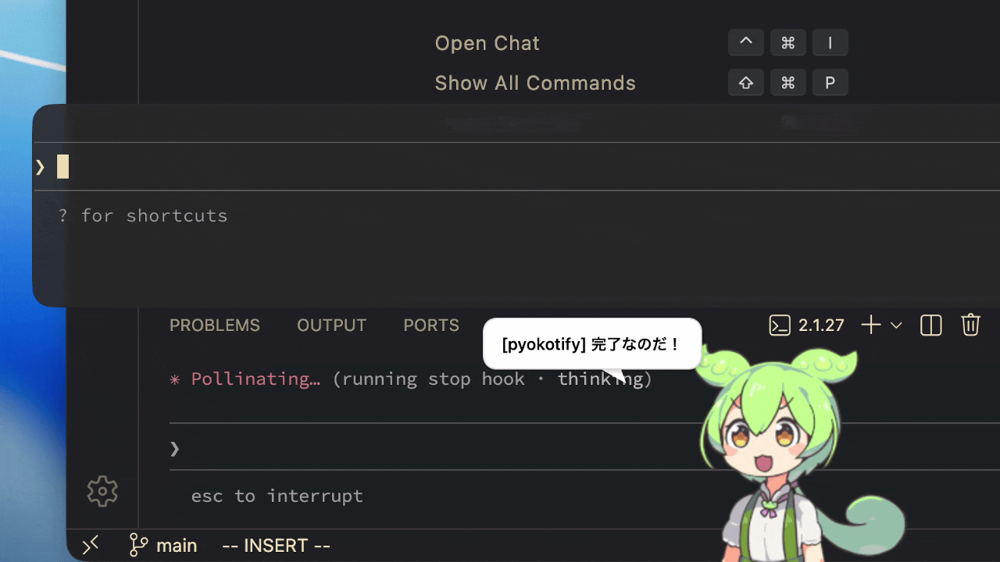
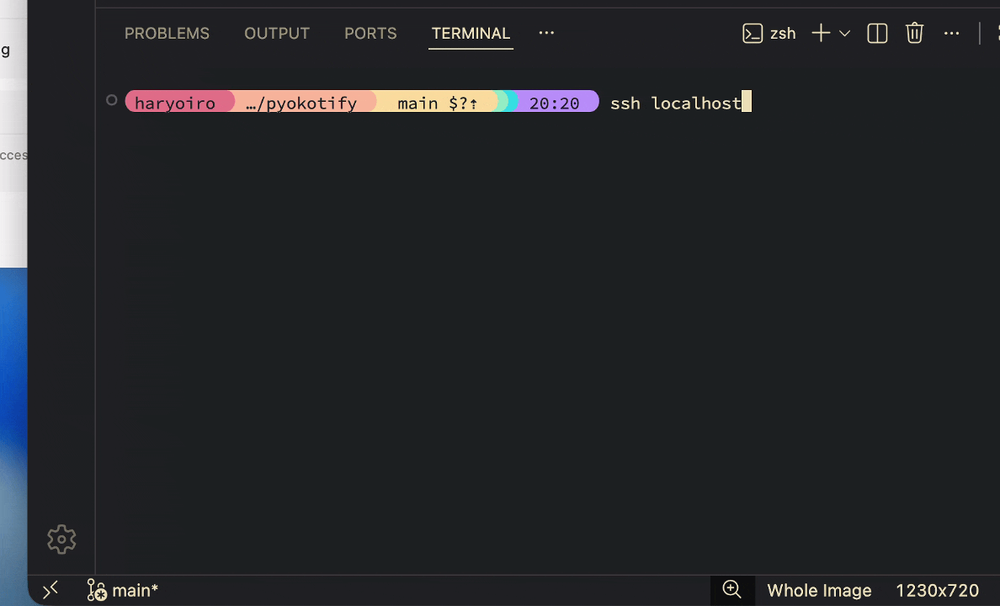

# pyokotify

A macOS notification app that makes characters peek from the screen edge.



## Requirements

- macOS 12.0+
- Swift 5.9+

Note: This tool uses macOS native APIs (AppKit, NSWindow) and does not work on Linux or Windows.

## Install

### Binary

```console
$ curl -fsSL https://raw.githubusercontent.com/haryoiro/pyokotify/main/install.sh | bash
```

### Build from source

```console
$ git clone https://github.com/haryoiro/pyokotify.git
$ cd pyokotify
$ swift build -c release
$ cp .build/release/pyokotify /usr/local/bin/
```

## Usage

```console
$ pyokotify <image-path>
$ pyokotify ~/Pictures/character.png
$ pyokotify ~/Pictures/character.png -t "Task completed!"
```

## Options

```
-d, --duration <sec>       Display duration (default: 3.0)
-a, --animation <sec>      Animation duration (default: 0.4)
-p, --peek <px>            Peek height (default: 200)
-m, --margin <px>          Margin from edge (default: 50)
-t, --text <message>       Show message in speech bubble
-c, --caller <app>         App to return to on click (TERM_PROGRAM value)
    --cwd <path>           Focus window containing this path
    --no-click             Disable click (pass-through mouse events)
-r, --random               Keep popping at random intervals
    --random-direction     Appear from random direction (bottom/left/right)
    --min <sec>            Min interval for random mode (default: 30)
    --max <sec>            Max interval for random mode (default: 120)
-h, --help                 Show help
```

## Use with Claude Code

pyokotify is designed to work with [Claude Code](https://docs.anthropic.com/en/docs/claude-code) hooks. Get notified when Claude needs your attention.

See [examples/claude-code-hooks](examples/claude-code-hooks) for a complete setup with Stop, Notification, and AskUserQuestion events.

Quick example - add to `~/.claude/settings.json`:

```json
{
  "hooks": {
    "AskUserQuestion": [
      {
        "matcher": "",
        "hooks": [
          {
            "type": "command",
            "command": "pyokotify ~/Pictures/character.png -t 'Claude has a question' -c $TERM_PROGRAM --cwd $PWD"
          }
        ]
      }
    ]
  }
}
```

## Examples

```console
# Show for 5 seconds with 300px peek height
$ pyokotify ~/Pictures/character.png -d 5 -p 300

# With speech bubble
$ pyokotify ~/Pictures/character.png -t "Build succeeded!"

# Random interval mode
$ pyokotify ~/Pictures/character.png -r --min 60 --max 300

# Random direction (bottom/left/right)
$ pyokotify ~/Pictures/character.png --random-direction
```

## Use with SSH

You can use it for various scenarios like SSH connection notifications.



## Accessibility Permission

The `--cwd` option requires accessibility permission to focus specific windows.

System Settings > Privacy & Security > Accessibility > Add your terminal app

The `--caller` option works without this permission.

## TERM_PROGRAM Values

| Terminal     | Value            |
| ------------ | ---------------- |
| VSCode       | `vscode`         |
| iTerm2       | `iTerm.app`      |
| Terminal.app | `Apple_Terminal` |
| Ghostty      | `ghostty`        |
| Warp         | `WarpTerminal`   |
| Alacritty    | `Alacritty`      |
| kitty        | `kitty`          |

## License

MIT
