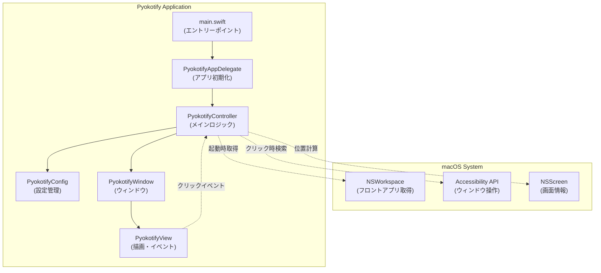
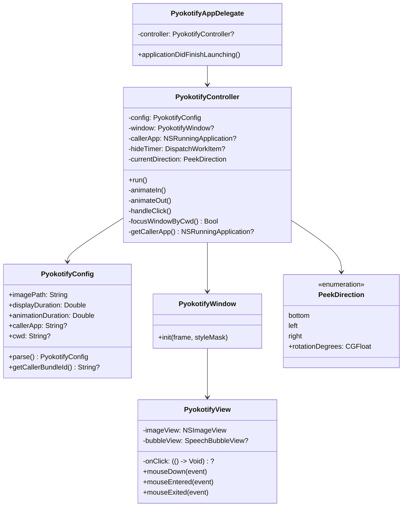
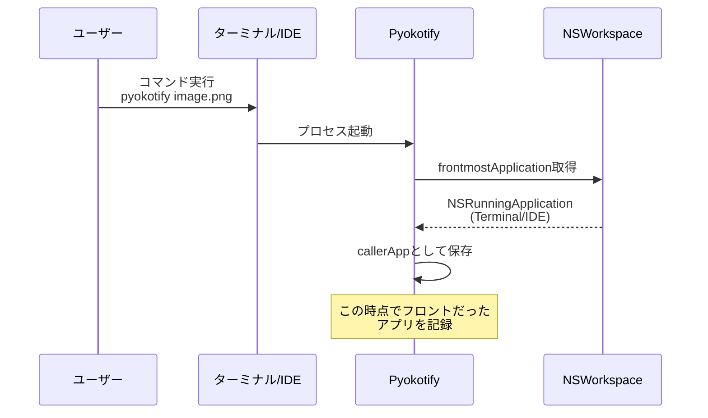
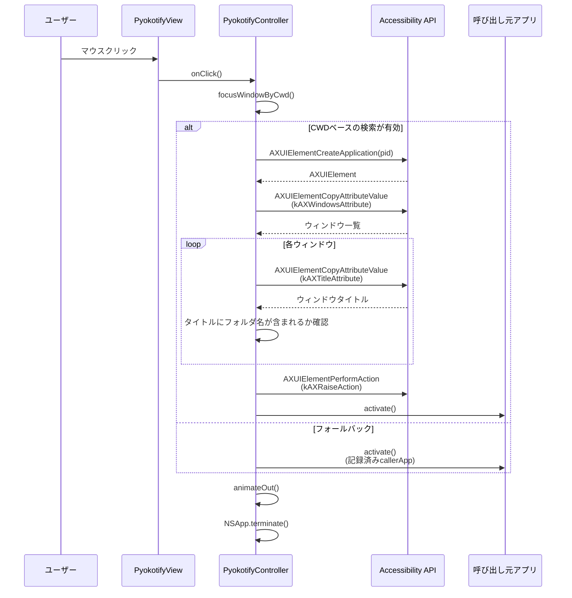
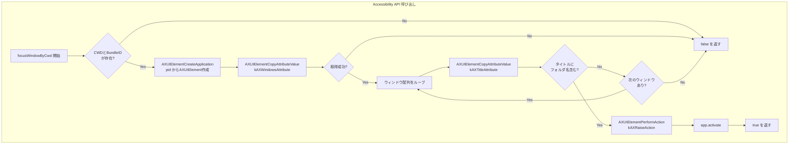
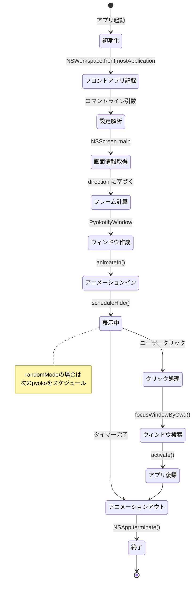
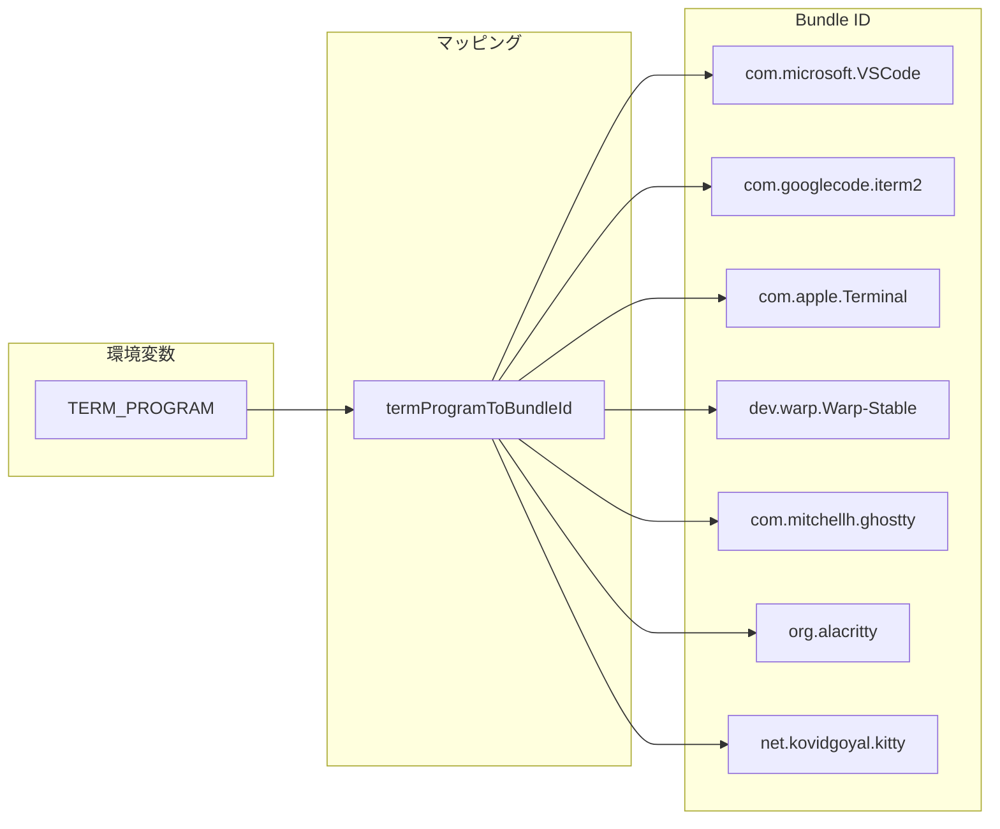
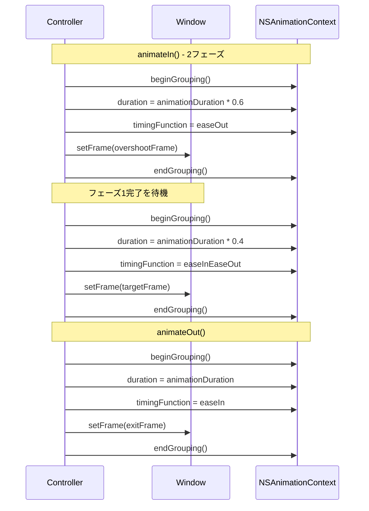
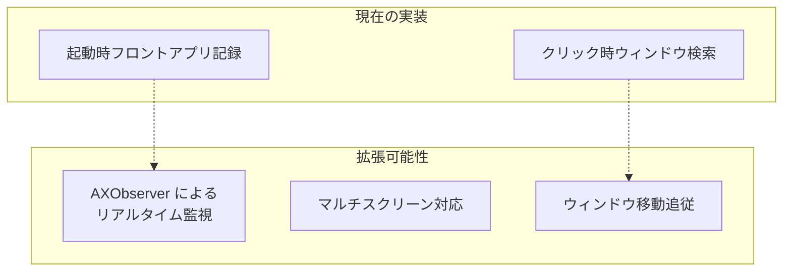

# Pyokotify ウィンドウ追跡の仕組み

Pyokotifyは画面端からキャラクターを表示する通知アプリです。このドキュメントでは、アプリがウィンドウやフォーカスを追跡し、呼び出し元アプリケーションに戻る仕組みを解説します。

## 概要

Pyokotifyは継続的なウィンドウ監視は行わず、以下の限定的な追跡を実装しています：

1. **起動時のフロントアプリ記録** - `NSWorkspace.shared.frontmostApplication`
2. **クリック時のウィンドウ検索** - Accessibility API使用
3. **呼び出し元への復帰** - `NSRunningApplication.activate()`

---

## アーキテクチャ全体図

---

## クラス構成図

---

## ウィンドウ追跡のフロー

### 1. 起動時のフロントアプリ記録

### 2. クリック時のウィンドウ検索と復帰

---

## Accessibility API の使用詳細

---

## イベントフロー全体

---

## ターミナルプログラムのマッピング

呼び出し元アプリケーションを特定するために、環境変数 `TERM_PROGRAM` からBundleIDへのマッピングを使用します：

| TERM_PROGRAM | Bundle ID |
|--------------|-----------|
| vscode / VSCode | com.microsoft.VSCode |
| iTerm.app | com.googlecode.iterm2 |
| Apple_Terminal | com.apple.Terminal |
| WarpTerminal | dev.warp.Warp-Stable |
| ghostty / Ghostty | com.mitchellh.ghostty |
| Alacritty | org.alacritty |
| kitty | net.kovidgoyal.kitty |
| Hyper | co.zeit.hyper |
| Tabby | org.tabby |
| tmux | com.apple.Terminal |

---

## アニメーションシーケンス

---

## 技術的な制限事項

### 現在の実装の制限

1. **継続的な監視なし** - AXObserverを使用したリアルタイム監視は未実装
2. **メインスクリーンのみ** - `NSScreen.main` を固定で使用
3. **起動時スナップショット** - フロントアプリは起動時のみ記録

### 将来の拡張可能性

---

## 関連ファイル

| ファイル | 役割 |
|---------|------|
| `Sources/pyokotify/main.swift` | エントリーポイント |
| `Sources/PyokotifyCore/Controller.swift` | メインロジック・ウィンドウ追跡 |
| `Sources/PyokotifyCore/Config.swift` | 設定管理・BundleIDマッピング |
| `Sources/PyokotifyCore/Views.swift` | UI・マウスイベント処理 |
| `Sources/PyokotifyCore/Direction.swift` | 表示方向管理 |
| `Sources/PyokotifyCore/Geometry.swift` | 座標計算 |
